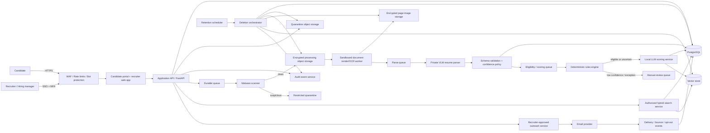

# Secure Local-First AI HR Screening Platform

> **Ported from the `HR-Screening` repo**, where it was written against a
> FastAPI + SQLAlchemy implementation. The requirements, threat analysis,
> security model and privacy rules still hold. Anything naming FastAPI
> routers, SQLAlchemy models, Alembic or arq queues describes the previous
> implementation and is now Frappe's responsibility — see
> [frappe-mapping.md](frappe-mapping.md). Not yet revised.

> **Document status:** Architecture baseline
>
> **Audience:** Engineering, security, privacy, HR operations, platform operations, and reviewers
>
> **System posture:** AI-assisted recruiting decision support. Recruiters retain authority over shortlisting, rejection, and all candidate communications.

## 1. Executive summary

This platform securely processes high-volume job applications, including a target burst of at least 1,000 applications for one role. It accepts candidate applications without requiring a candidate account, sends a receipt confirmation, scans and parses resumes in a private environment, applies approved job criteria, produces evidence-backed scorecards, supports authorized recruiter search and review, and sends recruiter-approved next-step or rejection communications.

The system is **local-first for candidate PII**. Raw resume content, extracted profiles, embeddings, and model inputs/outputs are processed by self-hosted services and local models wherever feasible. The platform is not an autonomous hiring system: no model output may independently reject, hire, alter job criteria, access arbitrary candidate records, or send external communications.

## 2. Goals and non-goals

### Goals

- Reduce recruiter review effort through structured extraction, evidence-backed matching, and ranked review queues.
- Support public application links with no candidate login requirement.
- Send a confirmation email after a valid application is accepted.
- Parse resumes and job descriptions into validated, versioned structured records.
- Apply deterministic eligibility rules before generative or probabilistic evaluation.
- Let HR rank, filter, search, review, override, shortlist, and reject candidates.
- Require HR approval before next-step or rejection email campaigns are sent.
- Delete candidate PII and derived sensitive artifacts within the configured retention period, with a target of 60 days after job closure unless a documented retention exception applies.
- Provide strong security, auditability, observability, recoverability, and cost control.

### Non-goals

- Fully autonomous hiring, rejection, or employment decisions.
- Inferring protected characteristics or using protected/proxy attributes for ranking.
- Training foundation models on candidate data by default.
- Replacing legal, HR, privacy, accessibility, or security review.
- Promising real-time screening: normal processing is asynchronous and batch-oriented.

## 3. Product workflow

```text
HR signs in
  -> creates a job and a versioned evaluation rubric
  -> publishes a public application URL

Candidate uses public link (no account)
  -> views privacy/AI notice
  -> submits application and resume
  -> receives confirmation email

Asynchronous pipeline
  -> validate upload -> quarantine -> malware scan
  -> isolated document rendering/OCR -> local resume parsing
  -> schema validation -> deterministic eligibility rules
  -> evidence-backed scoring -> recruiter review queue

Recruiter workflow
  -> review rank bands, evidence, and uncertainties
  -> override/correct data when needed
  -> explicitly shortlist or reject
  -> approve next-step/rejection campaign

Privacy workflow
  -> close job -> schedule deletion
  -> delete PII, documents, derived text, embeddings, prompts/responses, and message content
  -> retain only minimal, non-identifying deletion evidence and legally required records
```

## 4. Architecture principles

1. **Human authority:** Recruiters make meaningful employment decisions; AI provides decision support only.
2. **Local-first PII:** Candidate information remains in a private environment by default.
3. **Deterministic before generative:** Explicit approved rules run before LLM-assisted evaluation.
4. **Evidence over assertions:** Every automated match must point to candidate-provided source evidence or explicitly state that evidence is missing.
5. **Fail safely:** Failed scans, extraction failures, invalid JSON, unavailable models, and low-confidence outcomes go to manual review—not automatic rejection.
6. **Least privilege:** Access is scoped by tenant, job, role, and purpose.
7. **Version everything consequential:** Job criteria, prompts, models, parsing schemas, scoring policy, outreach templates, and human decisions are versioned.
8. **Privacy by lifecycle:** Deletion covers source files and all derived copies, including embeddings, prompts, model outputs, queues, search indexes, logs, and backups under their documented expiry policy.
9. **Async by default:** Application submission succeeds independently of downstream processing.
10. **Measure quality:** Extraction, matching, fairness, human overrides, and operational reliability are continuously measured.

## 5. Logical architecture



### Trust boundaries

- Only the WAF/load-balancer boundary is internet accessible.
- Recruiter, worker, database, object-storage, queue, vector-store, and model-serving workloads reside in private networks.
- Model servers have no public ingress and no general internet egress.
- Document rendering and malware scanning run in isolated, low-privilege sandboxes with no outbound network access.
- Every internal call uses workload identity; use mTLS/service mesh where operationally justified.

## 6. User roles and authorization

| Role | Permitted actions | Explicitly prohibited |
|---|---|---|
| Candidate | Submit application, view own status through signed link, exercise privacy requests | View other candidates or internal evaluation details |
| Recruiter | Review authorized jobs/applications, correct profiles, record decisions, approve outreach | Change global retention or platform security configuration |
| Hiring manager | View candidates only for assigned jobs; approve job criteria | Bulk export across jobs/tenants without separate authorization |
| Privacy officer | Process access, correction, deletion, and retention requests | Change assessment scores without HR authorization |
| Auditor | Read approved audit reports and evidence | Modify candidate or decision data |
| Platform administrator | Operate infrastructure, deploy services | Read resume content by default |
| Service identity | Execute one narrowly-scoped workload | Interactive user access or broad cross-service access |

Authorization is enforced server-side. Every data access carries `tenant_id`, actor identity, action, purpose, and applicable job/application scope.

## 7. Core workflows

### 7.1 Job creation and publication

1. An authorized HR user creates a draft job.
2. The job description is stored as a versioned source artifact.
3. The system may propose a job blueprint, but a recruiter or hiring manager must review and activate it.
4. The blueprint contains must-haves, nice-to-haves, approved weights, disallowed features, deterministic eligibility rules, and the job closing date.
5. Publication creates a cryptographically random public job identifier. Do not use sequential IDs.
6. The public job page includes the privacy notice and an AI-assistance disclosure where required by the applicable jurisdiction.

### 7.2 Candidate intake

1. Candidate opens the public application URL without creating an account.
2. The form captures only data required for the job and required notices/consent.
3. The browser uploads only to a short-lived, scoped upload target.
4. The intake API validates request ownership, file extension, MIME type, magic bytes, size, checksum, and page-count eligibility.
5. The file is written to encrypted quarantine storage.
6. A durable event triggers malware scanning.
7. The API creates an application record with an idempotency key and returns a confirmation response.
8. The confirmation-email event is processed separately; downstream parsing must never block intake.

### 7.3 Parsing and screening

1. Malware scanner marks the document clean, suspicious, or failed.
2. Clean files proceed to a sandboxed renderer that converts each page into bounded-resolution images; suspicious files remain in restricted quarantine.
3. The parser service submits page images to the private resume parser.
4. Parser output is stored as a raw processing artifact in restricted storage, then validated against the internal schema.
5. Invalid JSON, missing required fields, inconsistent dates, or low-confidence fields create a manual-review item.
6. The rules engine evaluates explicit eligibility conditions using configured thresholds and source evidence.
7. Candidates who pass or require nuanced review receive an LLM-generated, schema-constrained scorecard.
8. The service records evidence, uncertainty, model artifact/version, prompt version, criteria version, processing timestamps, and output hash.
9. Recruiter UI presents score bands and evidence; it does not present model output as verified fact.

### 7.4 Decision and outreach

1. A recruiter reviews the scorecard and resume evidence.
2. The recruiter records `shortlisted`, `rejected`, `hold`, or `needs_review`; overrides require a reason code.
3. A recruiter selects a pre-approved outreach template.
4. The system validates job access, final decision state, consent/contact preferences, suppression status, frequency cap, and duplication risk.
5. A local model may draft personalized text from permitted data only.
6. The recruiter approves the exact final content.
7. The worker sends the message and records provider message ID, delivery events, bounces, replies, and opt-outs.
8. The system never sends rejection or next-step messages solely because of model ranking.

### 7.5 Retention and deletion

The default target is deletion of candidate PII no later than 60 calendar days after `job_closed_at`.

```text
retention_delete_at = job_closed_at + 60 calendar days
```

1. When a job closes, the system calculates the deletion date for each associated application.
2. A daily scheduler identifies due records and marks them `deletion_in_progress` to block new access and emails.
3. The deletion orchestrator removes PII from primary and derived stores.
4. Each deletion step is idempotent and produces a non-PII completion record.
5. Exceptions require a documented legal hold, dispute/investigation, statutory retention requirement, or separate candidate opt-in for a talent pool.
6. A deletion ledger stores opaque IDs/hashes, system result, timestamps, and reason code—not candidate content.

### 7.6 Data stores covered by deletion

| Store | Delete or purge |
|---|---|
| PostgreSQL | Contact data, application answers, parsed profiles, scores, reviewer notes containing PII, personalized message bodies |
| Object storage | Resumes, cover letters, attachments, rendered images, OCR text, temporary artifacts |
| Vector store | Candidate embeddings and associated metadata |
| Cache and queues | Pending payloads, retries, dead letters, cached profile/evaluation records |
| Search index | Candidate text and search metadata |
| Model artifacts | PII-bearing prompts, responses, traces, and caches |
| Observability systems | Prevent PII at ingestion; expire/redact accidental capture under a documented process |
| Backups | Encrypt and expire/rotate according to the published backup retention window; document the maximum time before deleted data becomes unrecoverable from backups |

**Compliance note:** Do not assume a 60-day purge may remove every record in every jurisdiction. Public-job-posting and application-form retention obligations can differ from candidate-content retention. Separate statutory records from recruiter working data, minimize them, and obtain legal review for each supported jurisdiction.

## 8. Model and scoring design

### 8.1 Resume parser

The parser converts resume pages into a validated candidate profile. Treat all extracted fields as predictions, not verified facts.

- Deploy the parser in a private GPU environment.
- Maintain immutable model artifact hashes, license records, quantization configuration, inference settings, evaluation results, and deployment dates.
- Use a fixed parser instruction and do not concatenate resume text as privileged instructions.
- Enforce strict JSON-schema/Pydantic validation.
- Route parse failure or low-confidence extraction to manual review.

### 8.2 Job blueprint

A job blueprint is immutable once activated for a given evaluation version.

```json
{
  "role_id": "role_123",
  "version": 3,
  "must_haves": [
    {"criterion": "Python experience", "type": "skill", "required": true},
    {"criterion": "3 years backend development", "type": "experience", "minimum_years": 3}
  ],
  "nice_to_haves": ["AWS", "Kubernetes", "team leadership"],
  "disallowed_features": [
    "name", "age", "date_of_birth", "gender", "race", "ethnicity",
    "religion", "disability", "marital_status", "photograph", "postal_code",
    "school_prestige", "graduation_year"
  ],
  "weights": {
    "required": 0.55,
    "relevant_experience": 0.25,
    "nice_to_have": 0.15,
    "evidence_quality": 0.05
  },
  "approved_by": "user_id",
  "approved_at": "timestamp"
}
```

### 8.3 Decision layers

```text
Layer 1: deterministic eligibility
  - explicit authorization, location, certification, shift, and minimum-experience rules

Layer 2: AI-assisted evidence extraction and assessment
  - normalized skills, relevant experience, evidence spans, ambiguities, and schema-constrained scorecard

Layer 3: human decision
  - shortlist, reject, hold, request clarification, or override
```

The LLM must not return a definitive employment decision. It returns bounded, evidence-cited assessment data. The application code calculates rank bands and preserves all inputs/versions for reproducibility.

### 8.4 Score bands

| Band | Example range | Recruiter treatment |
|---|---:|---|
| Strong match | 80-100 | Review first; confirm supporting evidence |
| Potential match | 60-79 | Review gaps, transferable experience, and uncertainties |
| Needs review | 40-59 | Do not auto-reject; resolve ambiguous or missing evidence |
| Insufficient evidence | 0-39 | Show missing evidence; recruiter decides final outcome |
| Processing exception | N/A | Required manual review due to system/model failure |

## 9. Security architecture

### 9.1 Threats

Key threats include unauthorized PII access, malicious uploaded documents, prompt injection, cross-tenant data leakage, insider misuse, credential theft, abusive outreach, model/prompt regression, ransomware, and audit-log tampering.

### 9.2 Required controls

- TLS 1.2+ externally and internally; prefer TLS 1.3 where supported.
- WAF, request limits, rate limits, bot defense, CSRF controls, strict content security policy, and secure headers.
- SSO/OIDC/SAML and MFA for staff.
- Short-lived candidate sessions or signed email links scoped only to a candidate's own application.
- Server-side RBAC plus tenant/job-level authorization checks.
- Database row-level security for multi-tenant deployments where feasible.
- Encryption at rest for database, object storage, queues, backups, and vector-store disks; managed keys and separated environments.
- Short-lived workload credentials; secrets manager only; no secrets in source control, images, logs, or prompts.
- Malware scanning, MIME/magic-byte validation, sandboxed parsing, read-only filesystems, resource quotas, seccomp/AppArmor or equivalent, and no egress from document-processing containers.
- Service identities and explicit network allow lists; no public model server, database, queue, or vector-store endpoint.
- Tamper-evident, append-oriented audit events for high-value activities.
- Separate development, staging, and production accounts/projects with no production candidate PII on developer machines.

### 9.3 Prompt-injection controls

Resumes and job descriptions are untrusted data.

- Use fixed system instructions and explicit data delimiters.
- Use schema-constrained output and server-side validation.
- Do not grant model tool access in parsing or scoring flows.
- Restrict each model call to one authorized candidate and one authorized job.
- Never allow model output to modify criteria, trigger an email, retrieve arbitrary records, or change access controls.
- Log template/version and output hash; minimize or redact stored raw prompt content containing PII.
- Regression-test adversarial resumes, hidden text, conflicting instructions, and malformed structured output.

## 10. Data model

```text
Tenant
User
RoleAssignment
Job
JobVersion
JobCriteriaVersion
Candidate
CandidateContact
ConsentRecord
Application
ResumeDocument
ResumePageImage
ResumeExtraction
CandidateProfileVersion
EligibilityEvaluation
Scorecard
ModelRun
SearchIndexRecord
OutreachCampaign
OutreachTemplateVersion
OutreachDraft
OutreachMessage
HumanDecision
AuditEvent
PrivacyRequest
RetentionPolicy
DeletionLedger
```

Important relationships:

- A candidate can have multiple applications.
- Each application has a job, candidate profile version, document lineage, evaluation history, human decisions, and retention deadline.
- A scorecard references exactly one profile version, criteria version, model artifact/version, and prompt version.
- Each external message references a decision state, approved draft, template version, approver, and delivery record.
- A deletion event references opaque IDs/hashes and result state but should not retain candidate content.

## 11. Reliability and capacity

### 11.1 Queues and idempotency

Use durable queues between scanning, rendering, parsing, evaluation, embedding, outreach, and deletion. Each task carries a stable idempotency key such as `resume_extraction_id`, `profile_version_id`, `scorecard_run_id`, or `outreach_message_id`.

```text
scan-high          malware scanning; highest priority
document-render    document conversion and OCR
parse-standard     normal resume parsing
parse-priority     expedited jobs
score-standard     eligibility and scorecards
embedding-low      asynchronous search indexing
manual-review      invalid parse, ambiguity, low confidence
outreach           approved messages only
delete             retention and privacy-request deletion
```

Use exponential backoff with a small retry budget. Route repeated failures to a dead-letter queue and create an actionable operational alert.

### 11.2 Capacity planning

If a parser averages 90 seconds per resume, then 1,000 resumes require approximately 25 raw GPU-hours:

\[
\frac{1000 \times 90}{3600} = 25\ \text{GPU-hours}
\]

Budget additional capacity for rendering, queueing, retries, invalid JSON, GPU contention, and manual-review routing. Benchmark using representative résumés before publishing an SLA.

| Parser workers | Planning estimate for 1,000 resumes | Appropriate use |
|---|---:|---|
| 1 | 32-38 elapsed hours | Normal low-cost configuration |
| 2 | 16-20 elapsed hours | Priority jobs or concurrent roles |
| 3 | 11-14 elapsed hours | Short hiring window |
| 4 | 8-10 elapsed hours | Recovery or exceptional surge |

Scale based on forecasted completion time rather than raw queue depth:

\[
\text{estimated drain time hours} = \frac{\text{queued resumes} \times \text{measured average parse seconds}}{\text{active GPU workers} \times 3600}
\]

For a 72-hour standard target:

- 0-36 forecast hours: retain baseline capacity.
- 36-60 forecast hours: alert and monitor backlog/failure rate.
- 60-72 forecast hours: add capacity or reprioritize within documented policy.
- More than 72 forecast hours: scale if permitted or move the job into a controlled delayed-processing state.

### 11.3 Recovery objectives

Set actual recovery objectives after business review. A reasonable starting target is:

| Objective | Initial target |
|---|---|
| Application API availability | 99.9% monthly |
| Successful application persistence | 99.99% after a successful receipt response |
| Confirmation email provider acceptance | 99.5% within 5 minutes |
| Standard processing completion | 95% within 72 hours |
| Duplicate decision email rate | 0% |
| PII deletion deadline completion | 100%, excluding documented holds |
| RPO | <= 24 hours initially, subject to data-loss tolerance |
| RTO | <= 8 hours initially, subject to operational requirements |

## 12. Observability

Instrument the full workflow with structured logs, metrics, and distributed traces. Do not include raw resumes, access tokens, full email bodies, or unnecessary PII in standard logs.

### Metrics

- Intake rate, upload failures, validation failures, and confirmation-email success.
- Malware detections, rendering failure, parser latency, JSON validation failure, and manual-correction rate.
- Queue depth, age of oldest message, retry count, dead-letter volume, worker utilization, GPU memory/utilization, and estimated drain time.
- Eligibility outcomes, score distributions, evidence coverage, override rate, shortlist conversion, and sampled false-negative rate.
- Search latency, authorization denials, document views/downloads, exports, and anomalous bulk access.
- Outreach approval/send rate, delivery, bounce, opt-out, duplicate-send prevention, and reply-routing failures.
- Deletion backlog, deletion error rate, time-to-delete, legal-hold exceptions, and backup expiry status.

### Alerts

Alert on WAF anomalies, repeated authorization failures, privilege changes, abnormal exports, secret access anomalies, high parser/schema error rates, model regression, queue SLA breach risk, email anomaly, and any deletion task approaching its deadline.

## 13. Deployment

### Development

Use Docker Compose for local integration with synthetic data only:

- FastAPI service(s)
- PostgreSQL plus pgvector or Qdrant
- MinIO/S3-compatible object storage
- Redis/RabbitMQ
- CPU render worker and local model runner
- Test identity provider configuration

### Production

Use a private on-premises Kubernetes platform or a cloud/hybrid Kubernetes deployment with private GPU nodes. Prefer managed control-plane and data services where policy permits; retain private/local model inference for candidate PII.

- Container orchestration: Kubernetes/EKS/AKS/GKE or a managed private platform.
- GPU serving: vLLM or TensorRT-LLM with node isolation, capacity telemetry, and model artifact controls.
- Database: encrypted managed PostgreSQL or equivalent private deployment.
- Object storage: encrypted, versioned, lifecycle-controlled, separate quarantine and processing domains.
- Secrets/KMS: managed secrets manager and key management service.
- Delivery: Terraform infrastructure as code, immutable images, signed/provenance-aware artifacts, and controlled GitOps/CI-CD releases.

## 14. Testing and release gates

### Required tests

- **Unit:** eligibility rules, score calculations, date calculations, authorization, retention state machine, idempotency, recipient selection.
- **Integration:** upload to quarantine, malware scan, renderer, parser, queue retry/DLQ, profile persistence, scoring, vector filtering, email provider webhooks, deletion fan-out.
- **End-to-end:** HR publishes a job; anonymous candidate applies; confirmation email is sent; profile is reviewed; HR approves campaign; candidate receives exactly one appropriate outcome message; deletion completes.
- **Security:** SAST, dependency/SBOM scan, secret scan, container scan, IaC scan, API authorization tests, upload attack tests, DAST, and scheduled penetration testing.
- **AI quality:** extraction accuracy, JSON validity, evidence grounding, score/rubric agreement with human annotations, prompt-injection resilience, hallucination rate, and regression tests for every model/prompt/scoring change.
- **Fairness:** lawful representative evaluation, score distribution monitoring, override analysis, and periodic review of false-negative samples.
- **Load/soak:** 1,000-application burst, queue recovery, concurrent recruiter review, campaign sending, long-running memory/GPU stability.
- **Disaster recovery:** restore database/object metadata and verify RPO/RTO at least quarterly.

### Release blockers

Do not deploy a model, prompt, criteria, or application release when schema validity, evidence coverage, security scans, critical integration tests, authorization tests, or defined model-quality thresholds fail.

## 15. Cost model

Primary cost drivers:

- GPU hours for VLM parsing and LLM scoring.
- CPU document rendering/OCR and malware scanning.
- Persistent database/object/vector storage and backup retention.
- Network egress and email delivery.
- Observability ingestion/retention.
- Security tooling, SIEM, key management, and vulnerability scanning.

Cost controls:

- Use asynchronous batch processing and a small baseline GPU fleet.
- Apply deterministic rules before expensive model calls.
- Cache validated candidate profiles and reuse them only with appropriate purpose/consent controls.
- Store job embeddings/criteria once per version.
- Enforce model token, image resolution, page count, and context limits.
- Use low-priority embedding queues; do not block recruiter review on semantic indexing.
- Set log sampling, PII redaction, and bounded trace retention.
- Track cost per submitted application, per successfully processed resume, per recruiter-reviewed shortlist, and per model stage.

## 16. Implementation phases

### Phase 1: Secure intake and review

- HR SSO/MFA, RBAC, job creation/publication, public apply link, privacy notice.
- Scoped upload, quarantine, malware scanning, encrypted document storage.
- Document rendering, parser integration, validation, recruiter profile-correction UI.
- Foundational audit logging, backups, and initial retention state machine.

### Phase 2: Evidence-based screening

- Versioned job criteria and approved activation workflow.
- Deterministic rules engine.
- Local scorecard service, source evidence, rank bands, manual override and reason capture.
- Batch queue processing for 1,000-application scenarios.

### Phase 3: Search and scale

- Local embeddings, hybrid retrieval, row/tenant filtering, access audit.
- Two-pass scoring, measured scaling policy, dashboards, quality evaluations, and operational alerts.

### Phase 4: Controlled outreach and deletion hardening

- Approved templates, local drafting, exact-content approval, provider integration, suppression/opt-out, and delivery records.
- End-to-end 60-day PII deletion, deletion verification, backup lifecycle documentation, privacy-request workflows, and DR validation.

## 17. Open decisions

- Single-tenant deployment versus multi-tenant SaaS.
- Cloud, on-premises, or hybrid hosting and data-residency constraints.
- Jurisdictions supported and legally required records/retention periods.
- Candidate consent model and talent-pool opt-in model.
- GPU hardware, number of concurrently active roles, and expected actual document mix.
- ATS, email, calendar, and identity-provider integrations.
- Final parser, scoring, embedding model, licenses, and evaluation benchmarks.
- Whether candidate correction/status access is supported and what information may safely be disclosed.

## 18. Production acceptance checklist

- [ ] Staff use SSO and MFA.
- [ ] Role, tenant, and job scoping are tested server-side.
- [ ] All PII-bearing stores and backups are encrypted.
- [ ] No database, queue, object-store administration, vector store, or model-serving endpoint is public.
- [ ] Uploads are validated, scanned, quarantined, and sandbox-processed.
- [ ] Secrets are managed at runtime and secret scanning is enforced in CI.
- [ ] Candidate views, document accesses, searches, exports, criteria changes, model runs, decisions, and outreach actions are audited.
- [ ] Models return schema-constrained output and cannot make final decisions or send communications.
- [ ] Prompt-injection, malformed-document, authorization, and duplicate-send tests are release gates.
- [ ] Job criteria, models, prompts, parser schema, templates, and scorecards are versioned.
- [ ] Recruiters see source evidence and can correct/override results with reason capture.
- [ ] Candidate privacy, opt-out, export, correction, deletion, and retention paths are implemented.
- [ ] Retention deletion removes both raw and derived PII across all stores.
- [ ] Backup expiration and restoration have been tested and documented.
- [ ] WAF, rate limits, dashboards, alerts, incident response, vulnerability management, and rollback runbooks are operational.
